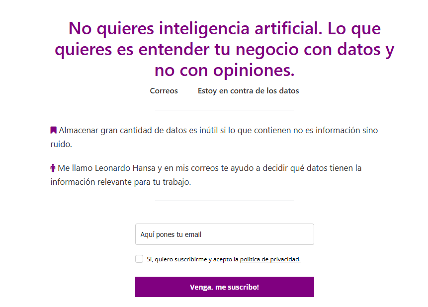
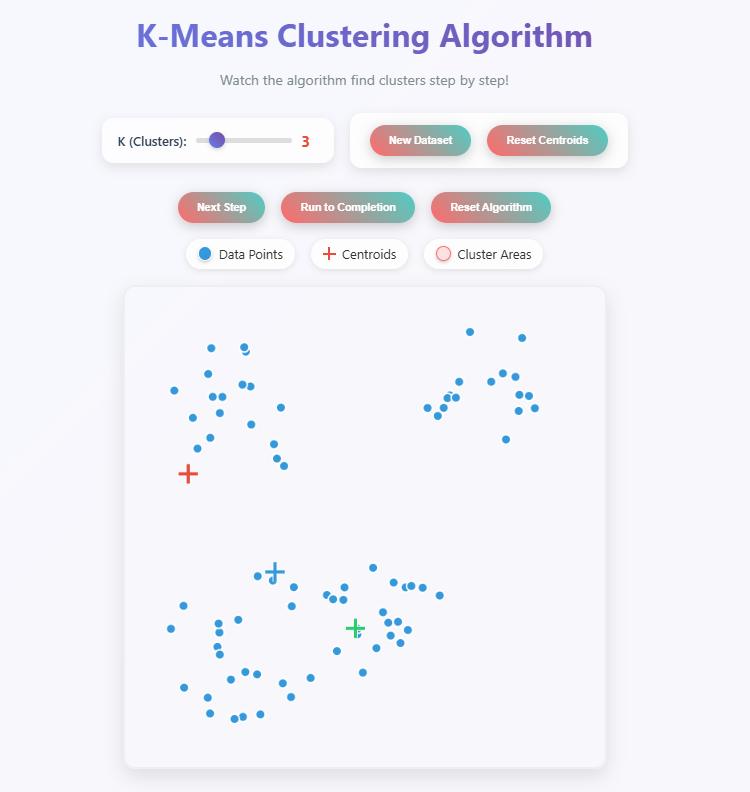
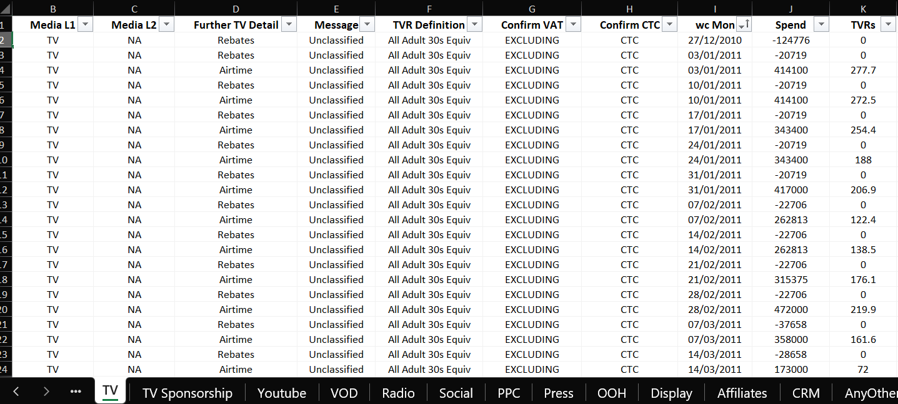

```{python}
#| echo: false
from pathlib import Path

import matplotlib.pyplot as plt
import pandas as pd
import numpy as np

from scipy.signal import savgol_filter

from src.metrics_recoding import (
    correlation_matrix,
    hierarchical_linkage,
    plot_dendrogram,
)
```

# ¿Cuál es la situación actual en análisis de datos?

## La IA está haciendo cada vez más y más trabajo

## ¿Pero quién es el responsable de ese trabajo?

## Tú

{fig-align="center"}

## La consecuencia de eso es que te tocará:

- Presentar tu trabajo
- Explicar tu trabajo
- Defender tu trabajo

# En este módulo practicarás eso

## Ingredientes del módulo

- 2 casos de uso
- Implementación por equipos
- Presentación de casos

# Evaluación el caso 1

## Resumen

::: {.incremental}

- Solución presentada
- Exposición
- Tribunal

:::

# Evaluación del caso 2

## Resumen

Ya hablaremos de ello...

## Resumen

...pero la idea rápida es que te tocará redactar.


# Sesiones

## Cómo quiero repartir las sesiones

- 5 y 6 de junio:
    + presentación del caso 1
    + trabajo en equipo del caso 1
- 12 de junio:
    + exposiciones del caso 1
    + presentación del caso 2
- 10 de julio: 
    + trabajo en el caso 2
    + entrega en el caso 2


## Material guía

:::: {.columns}

::: {.column}



:::

::: {.column}


:::

::::


# Caso 1. Agregación de métricas

## Empiezo con detalles de la evaluación

## Solución presentada

- 35%
- Misma nota para cada miembro
- Se valorará:
  - calidad técnica
  - validez de la solución

## Exposición

- 35%
- Individual
- Se valorará:
    - claridad
    - storytelling
    - defensa frente a las preguntas

## Tribunal (pregunta a otro equipo)

- 10%
- Individual
- Se valorará: 
    - La pertinencia
    - La originalidad
    - La capacidad de generar debate

## Problema de partida

```{python}
#| echo: false
score_file = Path("data/processed/daily-score.csv")
score_df = pd.read_csv(score_file)

date_col = score_df.columns[0]
score_df[date_col] = pd.to_datetime(score_df[date_col], errors="coerce")

numeric_cols = [
    col
    for col in score_df.columns
    if col != date_col and pd.api.types.is_numeric_dtype(score_df[col])
]

sample_size = min(6, len(numeric_cols))
sampled_cols = pd.Series(numeric_cols).sample(n=sample_size, random_state=42).tolist()

fig, axes = plt.subplots(2, 3, figsize=(13, 7), sharex=True)
axes = axes.flatten()

for i, col in enumerate(sampled_cols):
    axes[i].plot(score_df[date_col], score_df[col], linewidth=1.5)
    axes[i].set_title(col.replace("_", " ").title(), fontsize=10)
    axes[i].tick_params(axis="x", labelrotation=45)

for i in range(sample_size, len(axes)):
    axes[i].axis("off")

fig.suptitle("6 series temporales aleatorias (daily-score)", fontsize=14)
fig.tight_layout()
plt.show()
```

## Tenemos demasiadas métricas. El objetivo es unificarlas

## Fases

1. Paso de diario a semanal
2. Suavizado de las series temporales
3. Cálculo de la correlación entre las métricas
4. Clustering jerárquico para agrupar las métricas
5. Análisis de los clusters y cálculo de los centroides

## Repito: el objetivo del caso es unificar métricas

O sea, calcular nuevas métricas que sean combinaciones de las existentes. 

Por ejemplo, en lugar de 12 métricas habrá solo 3, pero tendrán más o menos la misma información.

## Nota

::: {.incremental}

- Muchas de las decisiones serán subjetivas. No hay una única solución correcta
- Ten en cuenta que tendrás que presentar y defender tus decisiones
- Sí, puedes usar IA

:::

## 1. Paso de diario a semanal

**Tarea.** Pasa el dato diario a semanal. 

## Contexto. Cómo se calculan las métricas

| Fecha      | Calidad | Calidad positiva | Calidad negativa | Calidad volumen |
|------------|---------|------------------|------------------|-----------------|
| 04/01/2016 | -13.23  | 18.43            | 91.50            | 552.46          |
| 05/01/2016 | -13.02  | 17.54            | 89.67            | 554.07          |
| 06/01/2016 | -14.85  | 16.54            | 100.22           | 563.66          |
| 07/01/2016 | -14.57  | 17.97            | 99.48            | 559.62          |
| 08/01/2016 | -15.15  | 21.26            | 109.15           | 580.06          |
| 09/01/2016 | -17.35  | 18.94            | 121.47           | 590.93          |
|     ...    |   ...   | ...              | ...              | ...             |


## Contexto. Cómo se calculan las métricas

$$
\mbox{calidad}_i = \frac{\mbox{calidad positiva}_i - \mbox{calidad negativa}_i}{\mbox{calidad volumen}_i}\times 100
$$

en la fecha $i$.

## ¿Cómo se agrega a semanal?

Vía libre. ¿Qué se te ocurre?


## 2. Suavizado de las series temporales

```{python}


weekly_file = Path("data/raw/YouGov Combined Jan 2015 - Mar 2020.xlsx")
weekly_df = pd.read_excel(weekly_file, sheet_name="YouGov Weekly")

date_col = weekly_df.columns[0]
weekly_df[date_col] = pd.to_datetime(weekly_df[date_col], errors="coerce")

numeric_cols = [
    col
    for col in weekly_df.columns
    if col != date_col and pd.api.types.is_numeric_dtype(weekly_df[col])
]

chosen_col = pd.Series(numeric_cols).sample(n=1, random_state=42).iloc[0]

series = weekly_df[[date_col, chosen_col]].dropna().set_index(date_col)[chosen_col]

smoothed_soft = savgol_filter(series.values, window_length=53, polyorder=3)
smoothed_responsive = savgol_filter(series.values, window_length=21, polyorder=3)

fig, (ax1, ax2) = plt.subplots(1, 2, figsize=(13, 5), sharey=True)

ax1.plot(series.index, series.values, linewidth=1, alpha=0.5, label="Original")
ax1.plot(series.index, smoothed_soft, linewidth=2.5, label="Suavizado")
ax1.set_title("Poco sensible", fontsize=11)
ax1.set_xlabel("Fecha")
ax1.legend()
ax1.tick_params(axis="x", labelrotation=45)

ax2.plot(series.index, series.values, linewidth=1, alpha=0.5, label="Original")
ax2.plot(series.index, smoothed_responsive, linewidth=2.5, label="Suavizado")
ax2.set_title("Más sensible", fontsize=11)
ax2.set_xlabel("Fecha")
ax2.legend()
ax2.tick_params(axis="x", labelrotation=45)

fig.suptitle(chosen_col.replace("_", " ").title(), fontsize=13)
fig.tight_layout()
plt.show()
```


## 2. Suavizado de las series temporales

**Tarea.** 

- Suaviza las series temporales para eliminar picos que no aportan información
- Decide el método y explica por qué lo has elegido

## 3. Cálculo de la correlación entre las métricas

|            | Buzz  | Quality | Impression | Value | ... |
|------------|-------|---------|------------|-------|-----|
| Buzz       | 1.00  | 0.73    | 0.85       | -0.12 | ... |
| Quality    | 0.73  | 1.00    | 0.61       | 0.34  | ... |
| Impression | 0.85  | 0.61    | 1.00       | -0.08 | ... |
| Value      | -0.12 | 0.34    | -0.08      | 1.00  | ... |
| ...        | ...   | ...     |  ...       | ...   | ... |


## 3. Cálculo de la correlación entre las métricas

**Tarea.** 

- Calcula la correlación de cada métrica con todas las demás
- Explica por qué hacemos esto

## 4. Clustering jerárquico para agrupar las métricas

**Tarea.** 

- Implementa los clusters
- Decide con cuántos te quedas y explóralos

# Teoría

## Idea general de clustering

```{python}
rng = np.random.default_rng(7)
centers = [(-3, -3), (0, 3), (4, -1)]
n = 80

points = np.vstack([
    rng.multivariate_normal(center, [[1, 0], [0, 1]], n)
    for center in centers
])
labels = np.repeat([0, 1, 2], n)
```

```{python}
colors = ["#e07b39", "#4a90d9", "#6abf69"]

fig, (ax1, ax2) = plt.subplots(1, 2, figsize=(12, 5))

ax1.scatter(points[:, 0], points[:, 1], color="black", alpha=0.6, s=30)
ax1.set_title("Datos sin etiquetar")
ax1.axis("off")
for spine in ax1.spines.values():
    spine.set_visible(True)
    spine.set_linewidth(1.5)
    spine.set_edgecolor("#cccccc")

for k, color in enumerate(colors):
    mask = labels == k
    ax2.scatter(points[mask, 0], points[mask, 1], color=color, alpha=0.7, s=30, label=f"Cluster {k + 1}")
ax2.set_title("Coloreados por cluster")
ax2.legend()
ax2.axis("off")
for spine in ax2.spines.values():
    spine.set_visible(True)
    spine.set_linewidth(1.5)
    spine.set_edgecolor("#cccccc")

plt.tight_layout()
plt.show()
```

## El centroide de un cluster es el punto medio, el elemento más representativo

```{python}
#| fig.align: "center"
fig, ax = plt.subplots(figsize=(6, 5))

for k, color in enumerate(colors):
    mask = labels == k
    ax.scatter(points[mask, 0], points[mask, 1], color=color, alpha=0.7, s=30, label=f"Cluster {k + 1}")
    centroid = points[mask].mean(axis=0)
    ax.scatter(centroid[0], centroid[1], color=color, marker="X", s=250, edgecolors="black", linewidths=1.5, zorder=5)

ax.set_title("Centroides de cada cluster")
ax.legend()
ax.axis("off")
for spine in ax.spines.values():
    spine.set_visible(True)
    spine.set_linewidth(1.5)
    spine.set_edgecolor("#cccccc")

plt.tight_layout()
plt.show()
```

Paradójicamente, el centroide no tiene por qué ser un punto real. Es solo una media


## Hay dos filosofías de clustering: jerárquico y particional

## Clustering no jerárquico: k-means

:::: {.columns}

::: {.column}
{fig-align="center"}
:::

::: {.column}
`https://www.interactive-ml.com/k-means.html`
:::

::::


## Clustering jerárquico: dendograma
```{python}
from scipy.cluster.hierarchy import dendrogram
corr_df = correlation_matrix(weekly_df.drop(columns=['6 Weeks ending']))
linkage_matrix = hierarchical_linkage(corr_df.iloc[0:10, 0:10])
# plot_dendrogram(linkage_matrix, labels=corr_df.iloc[:,0:10].columns.tolist())
fig, ax = plt.subplots(figsize=(8, 8))
dendrogram(linkage_matrix, labels=corr_df.iloc[:,0:10].columns.tolist(), ax=ax, orientation='left')
plt.show()
```

# Seguimos con el caso 1...

## 5. Análisis de los clusters y cálculo de los centroides

**Tarea.** 

- Calcula el centroide. Cada centroide es la agregación de las métricas que representa
- Analiza los centroides. ¿Qué representan? ¿Qué información aportan?


# A trabajar

## Metodología

- Parejas
- Trabajáis el caso
- Presentación de 20 minutos:
    + **12 de junio** 
- Puedes preguntarme cualquier duda durante el proceso
- Recuerda que no hay una única solución correcta

## Comentarios

::: {.incremental}

- El tribunal será otra pareja
- Cada miembro hará una pregunta
- Se valorará (muy) positivamente que la pregunta genere debates

:::

## Resumen de la tarea

1. Paso de diario a semanal de los datos
2. Suavizado de las series temporales
3. Cálculo de la correlación entre las métricas
4. Clustering jerárquico para agrupar las métricas
5. Análisis de los clusters y cálculo de los centroides
6. Preparación de la presentación para explicar el proceso y los resultados obtenidos
7. Como miembro del tribunal, preparación de pregunta


# Caso 2: monitorización de datos

## Problema de partida

{fig-align="center"}

## Problema de partida

- Datos para un análisis a fecha de hoy
- Tiempo después llegan nuevos datos para actualizar el análisis

**¿Cómo validar que los nuevos datos son coherentes con los anteriores?**

## Tarea

::: {.incremental}

- Tu jefe te ha pedido que automatices la validación de los nuevos datos. 
- **Explora** los datos y **piensa** qué características de los datos es importante supervisar para validar que los nuevos datos se parecen a los anteriores.
- **Redacta un correo electrónico** para que valide las reglas que se te han ocurrido.

:::

## Tarea

- Explora
- Piensa
- Redacta **en papel**
- Recuerda que puedes preguntarme cualquier duda
- Recuerda que no hay una única solución correcta

## La evaluación (20%) es a nivel pareja

::: {.incremental}

- Cada pareja redactará un correo
- Cuenta el 20% del módulo

::: 

# Recomendaciones finales

## Ideas sueltas

- Todos los datos están mal, pero algunos son útiles. 
- Los datos brutos tienen mucho ruido. Transfórmalos y tus modelos te lo agradecerán.
- No busques hacer proyectos de datos. Busca decisiones de negocio que merezca la pena resolver con datos.

## Consejos no solicitados

- Sigue por encima el trabajo de las ~~principales~~ empresas de tu sector. 
- Fórmate continuamente, no solo en lo más puntero sino también en los temas fundamentales de los que flojees. 
- Lee. Es la única forma de profundizar.

## Lecturas

- [Carlos Fenollosa](https://arpaeditores.com/products/la-singularidad)
- [Anabel Forte]() https://www.casadellibro.com/libro-como-sobrevivir-a-la-incertidumbre/9788412506327/13210905?srsltid=AfmBOopRUDgx4WVwYUu4PpBMT425-GmRBg0I8YtjRhbpXnwnmm0MNVlu)
- [Dale Carnegie](https://es.wikipedia.org/wiki/C%C3%B3mo_ganar_amigos_e_influir_sobre_las_personas)

# leonardohansa.com
